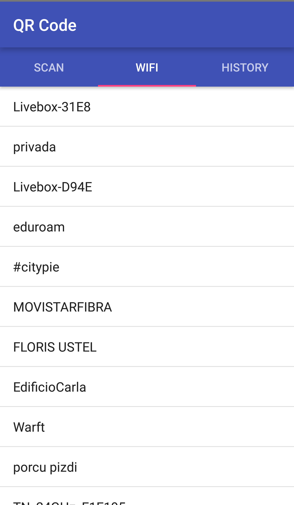

# QR Code Android application

# Implemented Features
* Scan QR codes containing Text, URLs and QR Wifis.
* Store scanned QR code contents in history
* Generate Wifi QR Codes to share the password

# Screenshots

# TODO
* Access to Wifi passwords for rooted devices
* Encrypt passwords with Android KeyStore
* Flashlight
* Better UI
* Support for more QR codes (Vcards, etc..)

# Libraries
* barcodefraglibv2
